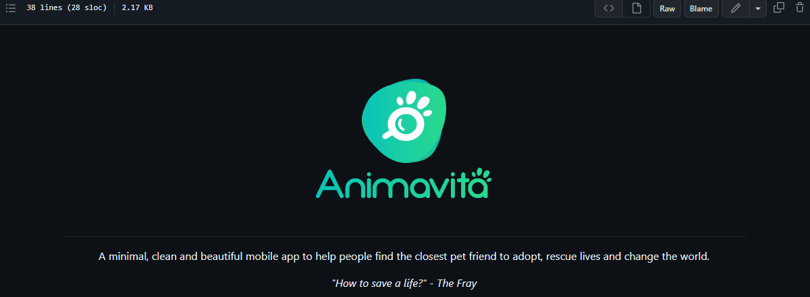

# Meu primeiro repositório com readme

## Descrição
Nesse exemplo de readme, estou colocando em prática o que foi passado na aula, qual a função do readme, o que pode ser colocado nele e como adicionar uma imagem ou gif nele.

#

## Exemplo de gif no readme.
[] 
### Observação: 
<i>Podemos a adicionar tanto GIFs como imagens nele, uma imagem que pode ser adicionada são as com links, que ao clica-la ela nos envie para algum site.</i>

#

## Tecnologias utilizadas
- HTML
- CSS
- JS